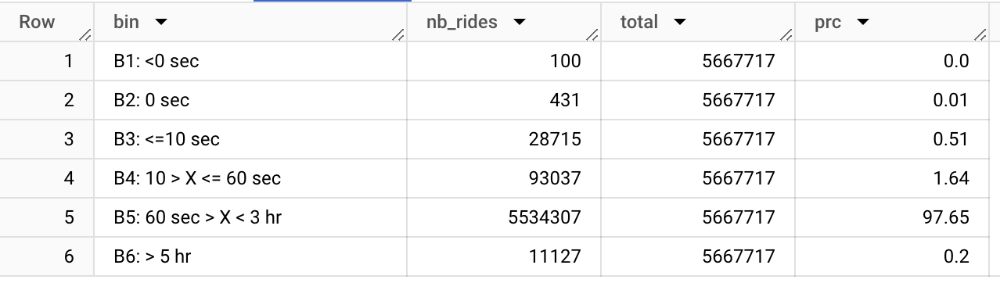

# Bikeshare rides analysis
## 1. Project - the What and the Why
After I completed the Google Data Analytics Certification program on [Coursera](https://www.coursera.org/professional-certificates/google-data-analytics), I was keen to use its material on practical examples. 

The program includes an optional guided project in which you can solve a business problem for a fictional bike-share service, called Cyclastic, by analyzing a real-world dataset. The dataset contained the ride history data and the **specific business task** of the analysis was to:
1. explore the differences between the activity of the casual riders and members (riders holding annual membership pass)
2. use these insights to make recommendations on how marketing efforts can convert casual riders into members

Even though the project was an optional part of the certification program, I chose to complete it because I was interested in using real-world dataset and solve a realistic business problem and it allowed me to brush up on my key data analysis skills.

**<span style="color:red">TODO: improve summary.**</span> *First, Intro to project: context, business task and summary of what I've done and with what tools (very high level) Then, Clearly list sections of doc with bookmark links. 1. Just the analysis report 2. Analysis steps (TBD if include queries in the steps or in appendix) 3. Details of data prep and cleanup. Details of prep and cleanup should be collapsed. Appendix (if present) will be collapsed. If you're here for a good time not a long time, go to solution*

This document will describe:
1. The summary of the project
2. Final solution for the business case - a slide presentation for the stakeholders with the business case insights and recommendations
3. Details of my analysis process, including the queries, lessons learned and ideas for future improvements

Since this is my first project, it will be very detailed so that I can use it as a knowledge base for my future projects. 

## 2. Summary

### 2.1. Process
I followed the analysis process provided by Google program and adjusted it to my preferences. The overall process I followed had 6 phases:
1. **Ask** - refined the specific business task for the project
2. **Prepare** - collected and evaluated the data needed for the analysis
3. **Process** - cleaned the data using SQL to get it ready for analysis
4. **Analyze** - defined relevant questions, ran SQL queries to answer them using the data, validated my hypotheses, and gained surprising insights
5. **Share** - created a business case presentation to share the insights with stakeholders, including using visualizations. The stakeholders in this case were the marketing director and the executive team of the fictional company
6. **Act** - updated the presentation to include recommendations to solve the business problem using the insights

### 2.2 Data Tools
- **SQL**
    - Timeframe for analysis was not defined by the project. I wanted to analyze at least 1 year of rides data (5M+ rows) and it was too large for spreadsheets
    - It allowed me to brush up on my SQL skills for data cleanup and analysis
    - To focus on the analysis itself, I used BigQuery - Google's serverless data warehouse solution which was the simplest way to set up a database.
- **Google Sheets**
   - Used for some calculations which are easier to do in spreadsheets than in SQL and to build visualizations
   - I chose Sheets over Excel as it's free and, from my past experience, it is often used by startups and scaleups. The skills built on Sheets will be easily transferrable to Excel.

## 3. Business Case Solution
The final presentation that solves the business case can be accessed [here](https://docs.google.com/presentation/d/1bwYGy23ZWJG5qMf0imZLOfAincOCCUbpCrCYMcIStbE/edit?usp=sharing)

**TODO: decide (1) how much info about the business case context (company, chicago etc) to include and (2) where should it be - here (if yes, which section) or the presentation itself?

## 4. Preparing the data
<details>
<summary> Click here for details </summary>
<br/>

The project is to solve the business problem of a fictional company. But the dataset to analyze comes from a real business. It is history of rides of a bikeshare service called Divvy, operated by Lyft in Chicago and is licensed out to public. 
- [Data](https://divvy-tripdata.s3.amazonaws.com/index.html) (AWS S3 bucket)
- [Data License](https://divvybikes.com/data-license-agreement)

<span style="color:red;">**TODO: Add a link to download my specific dataset**</span>

### 4.1. Loading Into Database
The rides data is stored in a series of .csv files. In some cases, the .csv holds a month of data, in others - a whole quarter of data. I chose to analyze the data from a whole year 2022 because it should represent normal activity, unaffected by Covid-19 and it would allow to analyze seasonality. To do this, I uploaded the 12 .csv files to a Google bucket and created a SQL table `rides` in BigQuery by merging all 12 files together, since the data structure of the .csv files was the same.

The dataset does not have any description or data dictionary. So, first, after inspecting the data, I built a data dictionary to help with cleanup and analysis later. For the "category" columns, I ran a `SELECT DISTINCT` query to find possible values.

Note the format below is as per BigQuery schema definition.
| Column | Description (assumed) | Format |
|---|---|---|
| ride_id | Primary key | String |
| rideable_type | Describes the typo of the bike used in the ride | String <br/> Possible values: electric_bike classic_bike docked_bike |
| started_at | Date and time when the ride started | Date / time |
| ended_at | Date and time when the ride ended | Date / time |
| start_station_id | ID of the station where the ride started (bike was picked up). | String |
| start_station_name | Describes the name of the station | String |
| end_station_id | ID of the station where the ride started (bike was picked up). | String |
| end_station_name | Describes the name of the station | String |
| start_lat	 | Latitude coordinate where the ride started | Float |
| start_lng	 | Longitude coordinate where the ride started | Float |
| end_lat | Latitude coordinate where the ride ended | Float |
| end_lng | Longitude coordinate where the ride ended | Float |
| member_casual | Describes the type of the rider - either casual rider or holding annual membership | String <br /> Possible values:<br/> casual <br/> member |

Note that the schema contains multiple attributes describing the station. These attributes should not be present in the rides data in a normalized relational DB structure. It creates duplication and can lead to inconsistencies.

### 4.2. Data Cleanup

#### 4.2.1. Process
These are the steps I took to clean the data inside the SQL table. 
1. Creating a backup copy of the table in case something goes wrong. 
2. Checking for duplicate entries
3. Checking for null values and % of rows with null values
4. Validating that the format of the columns
5. Checking for incorrect values (not as expected)
6. Renamed columns for clarity
7. Wrote query to add calculated columns to facilitate the analysis later and performed the checks (Steps 2-5) on them

**<span style="color:red"> TODO: Below these steps, give a summary of section: issues and what I did. Then go into details what I did to find the issues**

To ensure completeness and make data cleaning easier in the future, I created a checklist framework. I created a spreadsheet with column names in columns and the types of checks (steps 2-6) in rows. I went through each type of check and ran the check on each column, where it was relevant.

<span style="color:red;"> **TODO: Add the updated image of the cleanup framework table (from Sheets) here** </span>


Note that in case of a dataset with a large number of columns, we would need to pre-selecting the relevant columns before the cleanup.

**---------------**
#### 4.2.2. Findings and Changes Made

<span style="color:red;"> **TODO: ADD QUICK SUMMARY of the section and the rest should be in collapsed DETAILS section** </span>

<span style="color:red;"> **TODO: Don't forget to list the key issues found: no station names, docked bikes, negative and extreme ride length, different lat - long for same station id, 1500 stations when divvy says there are 800 (TBD - I can't say I didn't deal with this** </span>

**Duplicates**

I run a query to check the number of rides per ride_id and there were no IDs having more than 1 ride. 
```sql
SELECT
ride_id, COUNT(*) as nb_rides
FROM
`phrasal-brand-398306.bikeshare_data.rides`
GROUP BY ride_id
HAVING nb_rides <> 1
```

**Null values**

I used the following steps to inspect the null values in relevant columns:
1. Does the column have any null values?
2. What % of rows have null values for that column
3. Why the null values are there - is there an explanation or pattern
4. Decide hat to do with null values
    - If most values of a column are null, consider deleting the column
    - If some values are null, fill it in, if possible. If not possible, exclude the null values unless it impacts the core of the analysis.

Outcomes:
- Start and end station names and IDs have ~15% of null values. We could potentially fill them using the coordinates but it's too much efffort for 15% of the set and it's not the core of our analysis. I left it as-is.
- End station coordinates (lat and long) have a small amount of null values. It's a small amount so I left it as-is.
- No other columns had issues with null values

Counting null values (repeat the query for each relevant column)
```sql
SELECT
ROUND(SUM(CASE WHEN start_station_name IS NULL THEN 1 END)
/
(SELECT COUNT(*) from `phrasal-brand-398306.bikeshare_data.rides`) * 100, 2)
 AS prc_null_values
FROM `phrasal-brand-398306.bikeshare_data.rides`
```

**Format** 

After checking a few rows of the table, the formats seemed correct. There are some inconsistencies in the station_id column but we're not joining the data with the stations' data so it should not impact the analysis.
```sql
SELECT * 
FROM `phrasal-brand-398306.bikeshare_data.rides`
ORDER BY started_at
LIMIT 5
```

| ride_id | rideable_type | started_at | ended_at | start_station_name | start_station_id | end_station_name | end_station_id | start_lat | start_lng | end_lat | end_lng | member_casual |
|---|---|---|---|---|---|---|---|---|---|---|---|---|
| 98D355D9A9852BE9 | classic_bike | 2022-01-01 00:00:05.000000 UTC | 2022-01-01 00:01:48.000000 UTC | Michigan Ave & 8th St | 623 | Michigan Ave & 8th St | 623 | 41.872773 | -87.623981 | 41.872773 | -87.623981 | casual |
| 04706CA7F5BD25EE | electric_bike | 2022-01-01 00:01:00.000000 UTC | 2022-01-01 00:04:39.000000 UTC | Broadway & Waveland Ave | 13325 | Broadway & Barry Ave | 13137 | 41.94907317 | -87.64863283 | 41.93758232 | -87.64409781 | casual |
| 42178E850B92597A | electric_bike | 2022-01-01 00:01:16.000000 UTC | 2022-01-01 00:32:14.000000 UTC | Clark St & Ida B Wells Dr | TA1305000009 | Clark St & Ida B Wells Dr | TA1305000009 | 41.87591917 | -87.63119383 | 41.87593267 | -87.63058454 | casual |
| 6B93C46E8F5B114C | classic_bike | 2022-01-01 00:02:14.000000 UTC | 2022-01-01 00:31:07.000000 UTC | Michigan Ave & 8th St | 623 | Michigan Ave & 8th St | 623 | 41.872773 | -87.623981 | 41.872773 | -87.623981 | casual |
| 466943353EAC8022 | classic_bike | 2022-01-01 00:02:35.000000 UTC | 2022-01-01 00:31:04.000000 UTC | Michigan Ave & 8th St | 623 | Michigan Ave & 8th St | 623 | 41.872773 | -87.623981 | 41.872773 | -87.623981 | casual |

**Incorrect Values**

There are various checks that may be useful depending on the type of the data in the column. For example, checking if the dates are in expected range. Below I will detail the value checks I did.

- Rideable type  
```sql
SELECT rideable_type, ROUND(COUNT(*)  / (SELECT COUNT(*) from `phrasal-brand-398306.bikeshare_data.rides`) * 100, 2) as prc_rides
FROM `phrasal-brand-398306.bikeshare_data.rides`
GROUP BY rideable_type
```
While classic and electric bike types are self-explanatory, it's not clear what docked bike type means, since there is no dockless bike types in the dataset. . There is no definition of the values provided by the data owner. Looking at samples of older data, it seems that pre-2020 there were only docked bikes and around November 2020 it was split into "docked" and "classic" types. Since only 3% of rides were made using the docked bike tipe, we will assume that docked and classic bikes represent the same type of bike in this analysis. We are making changes to the table accordingly:
```sql
UPDATE `phrasal-brand-398306.bikeshare_data.rides`
SET rideable_type = 'classic_bike'
WHERE rideable_type = 'docked_bike'
```

-  Ride Started and Ended dates.
    - I checked that both dates are within the expected range. I selected the .csv files with 2022 rides. So the expected range for start date is within 2022 while end date may also be a little after last day of 2022. The ride start dates are within range. There is a ride that ended on 02/01/2023 but it's the only one so we will ignore it.
    ```sql
    SELECT
    MIN(started_at) AS min_start_date,
    MAX(started_at) AS max_start_date,
    MIN(ended_at) AS min_end_date,
    MAX(ended_at) AS max_end_date,
    FROM
    `phrasal-brand-398306.bikeshare_data.rides`
    ```
    - Next, I checked if there are cases where the ride end date and time equals start date/time or is before the start date/time. <br/>  :warning: It turns out there are 531 such cases. While it's a tiny percentage of the overall dataset (5M+ rows), it should not impact our analysis. But it's definitely alarming :triangular_flag_on_post: in terms of overall data quality. 
    ```sql
    SELECT started_at, ended_at, * 
    FROM `phrasal-brand-398306.bikeshare_data.rides`
    WHERE ended_at <= started_at
    ```
- Other
    - The "category" fields (rideable_type and member_casual) do not contain any whitespaces, typos or any problems. I checked it by looking at the values manually, since they are few.
    - There is no definition of constraints for station ID and name values provided by the data owner so I din't do any validation on it. It is not the core of our analysis.
    - No validation was done on the coordinates as it is not important to the analysis

**Adding calculated columns and renaming columns**

I renamed *member_casual* column to *rider_type* to make it clearer.

I ran queries to add and populate 4 calculated columns which would facilitate the analysis later. The ride length allows us to explore the usage patterns of casual riders and members and the 3 other columns allow us to explore the data in time series.
| Column | Description (assumed) | Format |
|---|---|---|
| ride_length | calculated ride length in seconds | Integer |
| start_day_of_week | day of week, when the ride was started. Note that I used `FORMAT_DATE` SQL function instead of usual `EXTRACT`, because it returns '1' for Mondays, which is what I want. `FORMAT_DATE` function returns strings so I transformed it to an Integer for easier analysis. | Integer |
| start_hour | the hour of the day when the ride started. | Integer |
| ride_month | the month when the ride started. | Integer |

```sql
ALTER TABLE `phrasal-brand-398306.bikeshare_data.rides`
ADD COLUMN ride_length INTEGER,
ADD COLUMN start_day_of_week INTEGER,
ADD COLUMN start_hour INTEGER,
ADD COLUMN ride_month INT;


UPDATE `phrasal-brand-398306.bikeshare_data.rides`
SET
ride_length = DATETIME_DIFF(ended_at, started_at, second),
start_day_of_week = CAST(FORMAT_DATE('%u', started_at) AS INT),
start_hour = EXTRACT(HOUR from started_at),
ride_month = EXTRACT(MONTH from started_at)
WHERE TRUE;
```

After creating calculated columns, it makes sense to do cleanup checks on their values as well. The start_day_of_week, start_hour and ride_month all have corect values and no null values. 

:warning: There are red flags with ride_length, though. 

First, I checked the minimum and maximum length values. 

```sql
SELECT 
min(ride_length) as min_length,
max(ride_length) as max_length 
FROM `phrasal-brand-398306.bikeshare_data.rides`;
```
This confirmed that there are very strange values. Minimum is -621,201s (more than -7 days) and maximum is 2,483,235s (over 28 days). That is a second red flag :triangular_flag_on_post: in the dataset. The extremely long rides are probably rides in which the bike was not returned or the return was not registered properly but there is no way to confirm without any dataset description available. 

Next, I checked what percentage of rows fall in the area of suspicious to see if the analysis will be at all possible. I divided the length into a number of bins that represent rides of negative length, 0 length rides, suspiciously short and suspiciously long rides. 

```sql
SELECT
CASE
WHEN ride_length < 0 THEN 'B1: <0 sec'
WHEN ride_length = 0 THEN 'B2: 0 sec'
WHEN ride_length > 0 AND ride_length <= 10 THEN 'B3: <=10 sec'
WHEN ride_length > 10 AND ride_length <= 60 THEN 'B4: 10 > X <= 60 sec'
WHEN ride_length > 60 AND ride_length <= 18000 THEN 'B5: 60 sec > X < 3 hr'
ELSE 'B6: > 5 hr'
END as bin,
COUNT(*) nb_rides,
(SELECT COUNT(*) FROM `phrasal-brand-398306.bikeshare_data.rides`) as total,
ROUND(COUNT(*)/(SELECT COUNT(*) from `phrasal-brand-398306.bikeshare_data.rides`)*100,2) as prc
FROM `phrasal-brand-398306.bikeshare_data.rides`
GROUP BY bin
ORDER BY bin;
```


Although the presence of such values is alarming, the total number of suspicious values is <2.5% of the overall dataset. As the majority of the dataset seems correct, I decided to proceed with the analysis. 

:warning: Note that the outlier values will create a positive skewness in the ride length distribution. I will use median instead of mean in our analysis to negate this.

**<span style="color:red"> TODO: Maybe add the issue of 25% station IDs having more than one name - need an explanation why I ignored it**

#### 4.2.3. Ideas for future improvement
**<span style="color:red"> TODO: list what should be improved to have really clean dataset (Nice to have)**
</details>

## 5. Analysis
After the dataset was cleaned, I moved to analysis steps.

### 5.1. Defining the questions
As a reminder, the business task definition was broad - provide insights on how annual members and casual riders use Cyclistic bikes differently. The certification project material gave some suggestions on specific questions but they were very basic:
> looking at the total number of rows, distinct values, maximum, minimum, or mean value

So, before I started the analysis, I had to define the list of specific questions, relevant to the business task, that I would answer using the data. To solve such cases easier in the future, I created a framework that provides guidance on where to start in defining the questions. 

Note that this framework does not give an exhaustive list of relevant questions and it will need to be adjusted to larger datasets but it's a solid start

<details>
<summary> Details of the framework </summary>

The framework to define the specific questions consists of following a few guiding steps:
1. Classify the columns in the table: timeseries (e.g. ride month), categories (e.g. rider type, rider type), numerical (e.g. ride length), nominal values (e.g. start station name). Note, BI tools such as Tableau automatically perform similar classification.
2. Define the list of timeseries analysis which make sense for the business task. It's a combination of the following questions: 
    - which numerical values should we analyze in the timeseries (e.g. number of rides)
    - what level timeseries (month, week, day, hour, etc.) are interesting  (e.g. number of monthly rides to explore seasonality)
    - which categories will we use to split the numerical values (e.g. the number of monthly rides by rider type to compare seasonality across different rider types).
3. List the possible combinations of (numerical value x 1 or more categories) and highlight the ones that are interesting to explore for the business task.
    - in the business task, there may be some key categories (in this case it was the rider type since we explore differences in activity of different rider types)
    - it may be interesting to also build numerical value summary table(s) for the overall dataset as well as broken down by interesting categories. 

 Steps 2 and 3 can provide matrices that highlight the questions to be answered with data, as a starting point for the analysis. For example, for this analysis, I created 2 matrices that guided my analysis: 

**Timeseries list**


**Combinations of categories**


This framework reminds me to consider some angles of exploration which I may not have thought about.
</details>

Using the framework mentioned above as a starting point, I decided that these queries will be a good start for our business task:
1. All summary questions<sup><b>*</b></sup> for the ride length measure, on overall dataset and broken down by rider type
1. Total number of rides broken down by month
1. Total number of rides broken down by month and rider type
1. Total number of rides broken down by day of week 
1. Total number of rides and average ride length (median) broken down by day of week and rider type
1. Total number of rides broken down by start hour and rider type
1. Total number of rides broken down by start hour of day and rider type
1. Total number of rides broken down by rider and rideable type
1. Top 10 stations where most rides start for each rider type
1. Top 10 routes taken by each rider type
1. Count distinct routes taken broken down by rider type
1. How clustered is the activity fo each rider type in terms of stations where rides start.

<sup><b>*</b></sup> By summary questions, I mean finding the following values on the ride length that give a sense of the distribution (I queried them on overall dataset and and grouped by rider type): 
- Total table row count (observations)
- Max field value
- Min field value
- Average (mean)
- 50th percentile value (median)
- 25th percentile value
- 75th percentile value
- Standard deviation

### 5.2. Ride Length Summary 
Summary queries allowed me to explore the distribution of the ride lengths. Note that the ride length values are **expressed in seconds**.

**Overall dataset**


**Broken down by rider type**


**:bulb: Key Insights**
- The mean is significantly higher than the median with high standard deviation, especially for the casual riders' activity. The distribution is heavily skewed due a long tail with extremely long rides, as seen in [Data Cleanup](https://github.com/justaszie/Bikeshare-Analysis/edit/main/README.md#422-findings-and-changes-made) step. We will use median to describe typical ride, instead of mean.
- There are more rides taken by members but without rider identifier attribute we don't know if it's due to higher number of riders or average rides per rider.
- Thre is a 60/40 division of data by rider type, which means the data is representative of both populations (casual riders and members).

### 5.3. Rides by Month
The below queries allow us to impact of seasonality on the rides activity.

**Overall Dataset**
```sql
-- Total rides by month
SELECT
ride_month,
COUNT(*) AS total_rides
FROM `phrasal-brand-398306.bikeshare_data.rides`
GROUP BY ride_month
ORDER BY ride_month;
```


**Broken down by rider type**

<span style="color:red">**TODO: Explain that I used "pivot" format for easier viz in Sheets**

```sql
-- Total rides by month and rider type
SELECT
ride_month,
COUNT(CASE rider_type WHEN 'casual' THEN 1 END) as rides_casual,
COUNT(CASE rider_type WHEN 'member' THEN 1 END) as rides_member,
COUNT(*) AS total_rides
FROM `phrasal-brand-398306.bikeshare_data.rides`
GROUP BY ride_month
ORDER BY ride_month;
```


**:bulb: Key Insights**
- Overall, there's a clear peak season (May - October) when 75% of the rides happen. It's predictable given the cold winters in Chicago. 
- Casual riders' activity has shorter and more intense peak. In April, casual riders reach 30% of their peak monthly rides value, while members are already at almost 60%.

### 5.4. Rides by day of the Week
We explore the usage patterns for different rider types during the week. It can give insights into service usage for daily commute. **Note, "1" in the results means Monday.**

**Overall Dataset**

```sql
-- Total rides by day of week
SELECT
start_day_of_week,
COUNT(*) AS total_rides
FROM `phrasal-brand-398306.bikeshare_data.rides`
GROUP BY start_day_of_week
ORDER BY start_day_of_week;
```


**Broken down by Rider Type**

```sql
-- 4 - Total rides and median by day of week and rider type
-- Step 1. Return median ride length values by rider type and day of the week.
WITH medians AS (
SELECT DISTINCT
start_day_of_week,
rider_type,
PERCENTILE_CONT(ride_length, 0.5) OVER(PARTITION BY rider_type, FORMAT_DATE('%u', started_at)) AS median_ride_length
FROM
`phrasal-brand-398306.bikeshare_data.rides`
),

-- Step 2. Return total ride count by rider type and day of the week
totals AS (
SELECT
start_day_of_week,
rider_type,
COUNT(*) AS total_rides
FROM
`phrasal-brand-398306.bikeshare_data.rides`
GROUP BY start_day_of_week, rider_type
)
-- Step 3. Create main query that pulls relevant values from the 2 separate queries. Since there are only 2 rider types, we define a column for each measure for each rider type (4 columns total).
SELECT DISTINCT t.start_day_of_week,
(SELECT total_rides FROM totals WHERE start_day_of_week = t.start_day_of_week AND rider_type = 'casual') AS total_rides_casual,
(SELECT total_rides FROM totals WHERE start_day_of_week = t.start_day_of_week AND rider_type = 'member') AS total_rides_member,
(SELECT median_ride_length FROM medians WHERE start_day_of_week = t.start_day_of_week AND rider_type = 'casual') AS median_ride_length_casual,
(SELECT median_ride_length FROM medians WHERE start_day_of_week = t.start_day_of_week AND rider_type = 'member') AS median_ride_length_member
FROM
totals t
ORDER BY t.start_day_of_week;
```


**:bulb: Key Insights**
- Overall, the number of rides taken steadily increases as the week goes, reaching its peak on Saturday. No suprises here.
- The members' rides seem to have daiy commute pattern VS more leisure-centered activity for casual riders. On an average weekday, members take 17% more rides than on a weekend day. Casual riders, on average, take 48% more rides on weekends. 

### 5.5. Rides by Starting Hour
Looking at the “busiest times” for each rider type allows to find patterns and potentially validate the commute hypothesis for members.

```sql
SELECT start_hour,
count(*) AS total_rides,
SUM(CASE rider_type WHEN 'casual' THEN 1 END) AS casual_rides,
SUM(CASE rider_type WHEN 'member' THEN 1 END) AS member_rides,
FROM `phrasal-brand-398306.bikeshare_data.rides`
WHERE day_of_week NOT IN (6,7) -- Change this condition to IN (6,7) for weekend rides
GROUP BY start_hour
ORDER BY start_hour
```

**Weekday Rides**


**Weekend Rides**


**:bulb: Key Insights**
- Activity on weekends is similar for both types of customers. But the activity is clearly different on weekdays - members have spikes in activity during "commuter" hours (7-8am and 4-6pm) and casual riders increase their activity steadily until 5pm. This signals commuting pattern for members.

### 5.6. Rides by Rideable Type
We are exploring if casual riders and members have any preferences in terms of bike types (classic or electric bikes).

```sql
-- Total rides by rider and rideable type
SELECT
rider_type,
COUNT(CASE rideable_type WHEN 'electric_bike' THEN 1 END) as rides_electric,
COUNT(CASE rideable_type WHEN 'classic_bike' THEN 1 END) as rides_classic,
COUNT(*) AS total_rides
FROM `phrasal-brand-398306.bikeshare_data.rides`
GROUP BY rider_type;
```


The results are pretty equally distributed in both cases so there are no conclusions to draw here.

### 5.7. Ride Start Stations
Next set of queries allow us to see if casual riders and members start their rides in different or similar locations. Since there are hundreds of stations in the dataset, we look at TOP 10 stations, where most of the rides start and look for any patterns.

```sql
WITH counts AS(
    SELECT
    rider_type,
    start_station_name,
    COUNT(*) AS total_rides,
    RANK() OVER (PARTITION BY rider_type ORDER BY COUNT(*) DESC) AS station_rank
    FROM `phrasal-brand-398306.bikeshare_data.rides`
    -- Ignoring stations with null values
    WHERE start_station_name IS NOT NULL
    GROUP BY rider_type, start_station_name
)

SELECT *
FROM counts
WHERE station_rank <= 10;
```
**Top 10 stations for Casual Riders**


**Top 10 stations for Members**


**Stations clustering for Casual Riders**

While looking at the distribution of rides startign at various stations, I noticed a lot of stations had 1 or 2 rides that started there. Inspired by the 80/20 principle, I decided to check if it applies here - i.e. if a small subset of starting stations cover most of the rides. 
If it's confirmed, it could help focus the physical marketing assets to a small number of areas. 

```sql
WITH station_ride_counts AS (
    SELECT
    start_station_name,
    COUNT(*) AS station_rides,
    RANK() OVER (ORDER BY count(*) DESC) AS station_rank
    FROM `phrasal-brand-398306.bikeshare_data.rides`
    -- Ignoring stations with null values
    WHERE start_station_name IS NOT NULL
    AND rider_type = 'casual'
    GROUP BY start_station_name
    ORDER BY 3 ASC
)

SELECT
start_station_name,
station_rides,
SUM(station_rides) OVER (ORDER BY station_rank ASC) AS cumul_rides, -- Number of cumulative rides - i.e. sum of rides started in stations from TOP 1 station to the current station, included
ROUND(SUM(station_rides) OVER (ORDER BY station_rank ASC) / SUM(station_rides) OVER() * 100, 2) as prc_total_rides, -- Number of cumulative rides as a % of total rides
station_rank,
ROUND(station_rank / (SELECT MAX(station_rank) FROM station_ride_counts) * 100, 2) as prc_stations -- Number of stations (from TOP 1 station to the current station, included) as a % of total number of stations
FROM station_ride_counts
ORDER BY station_rank
```


**:bulb: Key Insights**
- Casual riders seem to use the service for leisure and members are using it for their commute. 
    - Casual riders start their rides mostly around leisure spots and scenic areas
    - Members start their rides in the middle of the city, near universities, etc.
- The activity of casual riders is clustered. 90% of the rides start in 350 stations (out of 800+ total).

### 5.7. Routes Taken
Similar to start stations, we are checking for any patterns in what routes the casual riders and members are taking.

**Top 10 routes**
```sql
-- Total rides by rider and route
WITH counts AS(
    SELECT
    rider_type,
    CONCAT(start_station_name, " - ", end_station_name) AS route,
    -- After the first look, I noticed routes that start and end in same station. In this V2 of the query, I added a specific column for better visibility.
    (start_station_name = end_station_name) AS same_station,
    COUNT(*) AS total_rides,
    RANK() OVER (PARTITION BY rider_type ORDER BY COUNT(*) DESC) AS route_rank
    FROM `phrasal-brand-398306.bikeshare_data.rides`
    --  Ignoring routes that have either start or end station as null
    WHERE start_station_name IS NOT NULL AND end_station_name IS NOT NULL
    GROUP BY 1, 2, 3
)

SELECT *
FROM counts
WHERE route_rank <= 10;
```

**Top 10 routes for Casual Riders**


**Top 10 routes for Members**


**Number of distinct routes**
Finally, I decided to check if there are differences in the variety of routes taken by casual riders and by members. 

```sql
SELECT
rider_type,
COUNT(DISTINCT CONCAT(start_station_name, " - ", end_station_name)) AS num_routes,
FROM `phrasal-brand-398306.bikeshare_data.rides`
-- Ignoring routes that have either start or end station as null
WHERE start_station_name IS NOT NULL AND end_station_name is not null
GROUP BY rider_type
```


**:bulb: Key Insights**
- There are very different patterns in routes taken by casual riders and by members. This confirms the theory of casual riders using the service for leisure and members using it for their commute.
    - The majority of most popular routes for casual riders start and end in the same station. This means that the purpose of the ride is not transportation but the ride itself.
    - The most popular routes for members have a clear "round-trip" pattern.  
- There are no differences in number of different routes taken by different riders.

# 6. Appendix A - SQL Queries for Analysis
## Ride Length Summary 
**Overall dataset**
```sql
-- All summary questions for ride length
SELECT
COUNT(*) AS total_rides,
MIN(ride_length) AS min_ride_length,
MAX(ride_length) AS max_ride_length,
ROUND(AVG(ride_length),0) AS mean_ride_length,
(SELECT PERCENTILE_CONT(ride_length, 0.25) OVER() FROM `phrasal-brand-398306.bikeshare_data.rides` LIMIT 1) AS perc_25_ride_lengh,
(SELECT PERCENTILE_CONT(ride_length, 0.5) OVER() FROM `phrasal-brand-398306.bikeshare_data.rides` LIMIT 1) AS median_ride_length,
(SELECT PERCENTILE_CONT(ride_length, 0.75) OVER() FROM `phrasal-brand-398306.bikeshare_data.rides` LIMIT 1) AS perc_75_ride_lenght,
STDDEV(ride_length) AS std_dev_ride_length,
FROM `phrasal-brand-398306.bikeshare_data.rides`;
```


**Broken down by Rider Type**
```sql
-- All summary questions for ride length by rider type
-- Step 1. Return median ride length values by rider type
WITH percentiles AS (
SELECT DISTINCT
rider_type,
PERCENTILE_CONT(ride_length, 0.25) OVER(PARTITION BY rider_type) AS perc_25_ride_lengh,
PERCENTILE_CONT(ride_length, 0.5) OVER(PARTITION BY rider_type) AS median_ride_length,
PERCENTILE_CONT(ride_length, 0.75) OVER(PARTITION BY rider_type) AS perc_75_ride_lenght
FROM
`phrasal-brand-398306.bikeshare_data.rides`
),


-- Step 2. Return summary table (except percentiles)
summary AS (
SELECT
rider_type,
COUNT(*) AS total_rides,
MIN(ride_length) AS min_ride_length,
MAX(ride_length) AS max_ride_length,
ROUND(AVG(ride_length),0) AS mean_ride_length,
STDDEV(ride_length) AS std_dev_ride_length,
FROM `phrasal-brand-398306.bikeshare_data.rides`
GROUP BY rider_type
)


-- Step 3. Join summary table with percentiles values
SELECT summary.rider_type, total_rides, min_ride_length, max_ride_length, mean_ride_length, median_ride_length, perc_25_ride_lengh, perc_75_ride_lenght, std_dev_ride_length
FROM
summary
JOIN
percentiles
ON summary.rider_type = percentiles.rider_type;
```


<br /><br />

# ----------- OUTLINE WIP --------------


## Structure
3. Analysis steps
    1. Framework for selecting the specific questions - 
        1. Categorizing datapoints to time series, categories, numericals
        2. Building matrices of what matters
    2. The questions that I ran, the queries and the results
        - Add queries as code, add images as results 
        - Add viz next to results
    3. Visualizing the results - exporting to Sheets, some reformatting and creating
        - Add the viz images, add bookmark link to question in analysis section (and vice versa?)
3. Lessons Learned - **TODO**


